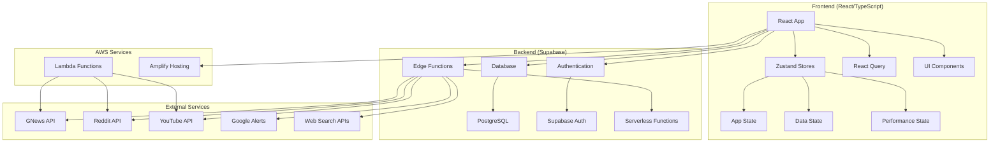

# Architecture Overview

## System Architecture

Brand Zen is built as a modern, scalable web application with a clear separation of concerns between frontend, backend, and external services.



## Frontend Architecture

### Component Structure

The frontend follows a modular component architecture:

```
src/components/
├── ui/                    # Reusable UI components (shadcn/ui)
│   ├── button.tsx
│   ├── card.tsx
│   ├── table.tsx
│   └── ...
├── ErrorBoundaries.tsx    # Error boundary components
├── VirtualizedMentionsTable.tsx  # Virtualized data table
├── VirtualizedNotificationsList.tsx  # Virtualized notifications
├── ErrorMonitoringDashboard.tsx  # Admin error monitoring
└── ...
```

### State Management

**Zustand Stores:**

1. **AppStore** (`src/store/appStore.ts`)
   - User authentication state
   - Theme preferences
   - Navigation state
   - Global UI state

2. **DataStore** (`src/store/dataStore.ts`)
   - Mentions data
   - Notifications
   - Analytics data
   - Search filters

3. **PerformanceStore** (`src/store/performanceStore.tsx`)
   - Performance metrics
   - Error tracking
   - Monitoring data

### Data Fetching

**React Query Integration:**
- Centralized data fetching with `useOptimizedQueries.ts`
- Automatic caching and background updates
- Optimistic updates
- Error handling and retry logic

**Data Service Layer:**
- `dataService.ts` abstracts all Supabase operations
- Consistent error handling
- Type-safe API calls

### Performance Optimizations

1. **Data Virtualization**
   - `react-window` for large lists
   - VirtualizedMentionsTable for mentions
   - VirtualizedNotificationsList for notifications

2. **Code Splitting**
   - Vite automatic code splitting
   - Route-based lazy loading
   - Dynamic imports for heavy components

3. **Caching Strategy**
   - React Query for API caching
   - Zustand for client-side state
   - Local storage for user preferences

## Backend Architecture

### Database Schema

**Core Tables:**
- `profiles` - User profiles and settings
- `mentions` - Brand mentions from all sources
- `notifications` - User notifications and alerts
- `user_fetch_history` - API usage tracking
- `api_usage_tracking` - Detailed API metrics

### Edge Functions

**Supabase Edge Functions:**
- `automated-mention-fetch` - Main data collection
- `google-alerts` - Google Alerts processing
- `aggregate-sources` - Data aggregation
- `send-twilio-notification` - SMS notifications
- `send-email-notification` - Email alerts

### Authentication & Authorization

- **Supabase Auth** for user management
- **Row Level Security (RLS)** for data protection
- **Role-based access control** (Admin, Moderator, User)
- **JWT tokens** for API authentication

## External Integrations

### Data Sources

1. **GNews API**
   - News article fetching
   - Sentiment analysis
   - Source credibility scoring

2. **Reddit API**
   - Subreddit monitoring
   - Comment analysis
   - Community sentiment

3. **YouTube API**
   - Video title/description monitoring
   - Comment sentiment analysis
   - Channel tracking

4. **Google Alerts**
   - RSS feed processing
   - Automated keyword monitoring
   - Real-time updates

5. **Web Search APIs**
   - General web content
   - Blog post monitoring
   - Forum discussions

### AWS Services

1. **Lambda Functions**
   - External API integrations
   - Data processing pipelines
   - Scheduled tasks

2. **Amplify Hosting**
   - Static site hosting
   - CDN distribution
   - Automatic deployments

## Security Architecture

### Data Protection

- **Encryption at rest** (Supabase)
- **HTTPS everywhere** (TLS 1.3)
- **API key management** (environment variables)
- **Input validation** (TypeScript + runtime checks)

### Access Control

- **Authentication** via Supabase Auth
- **Authorization** via RLS policies
- **Admin-only features** with role checks
- **API rate limiting** and monitoring

### Error Handling

- **Error boundaries** for React components
- **Global error handler** for uncaught errors
- **Structured logging** with severity levels
- **Error monitoring dashboard** for admins

## Scalability Considerations

### Frontend Scaling

- **Code splitting** for faster initial loads
- **Data virtualization** for large datasets
- **Caching strategies** to reduce API calls
- **Performance monitoring** for optimization

### Backend Scaling

- **Database indexing** for query performance
- **Connection pooling** for database efficiency
- **Edge function optimization** for cost control
- **API rate limiting** to prevent abuse

### Data Scaling

- **Pagination** for large result sets
- **Data archiving** for old mentions
- **Aggregation strategies** for analytics
- **Caching layers** for frequently accessed data

## Monitoring & Observability

### Performance Monitoring

- **Real-time metrics** via PerformanceStore
- **Component render times** tracking
- **API response times** monitoring
- **User interaction analytics**

### Error Monitoring

- **Error boundary** integration
- **Structured error logging**
- **Admin error dashboard**
- **Error classification** and severity

### Business Metrics

- **User engagement** tracking
- **API usage** monitoring
- **Cost optimization** metrics
- **Feature adoption** analytics

## Development Workflow

### Local Development

1. **Supabase Local** for database development
2. **Hot reloading** for frontend changes
3. **Type checking** with TypeScript
4. **Linting** with ESLint

### Testing Strategy

- **Unit tests** for utilities and hooks
- **Integration tests** for API calls
- **E2E tests** for critical user flows
- **Performance tests** for optimization

### Deployment Pipeline

1. **GitHub** for source control
2. **AWS Amplify** for automatic deployments
3. **Environment management** for different stages
4. **Rollback capabilities** for quick recovery
