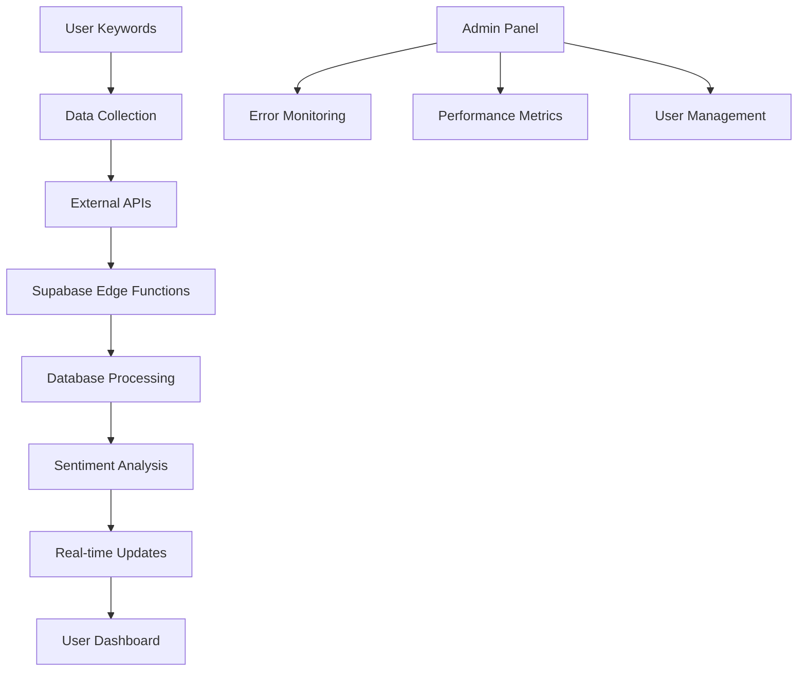

# Brand Zen - Project Overview

## 🎯 Project Mission

Brand Zen is a comprehensive brand monitoring and sentiment analysis platform that helps businesses track their brand mentions across multiple sources, analyze sentiment, and get real-time alerts for important brand-related events.

## 🚀 Key Features

### Core Functionality
- **Multi-Source Monitoring**: Track mentions from news, Reddit, YouTube, web search, and Google Alerts
- **Sentiment Analysis**: AI-powered sentiment scoring (-100 to +100 scale)
- **Real-Time Alerts**: Instant notifications for negative sentiment or flagged mentions
- **Analytics Dashboard**: Comprehensive analytics and reporting
- **User Management**: Role-based access control (Admin, Moderator, User)

### Technical Features
- **High Performance**: Data virtualization for large datasets
- **Real-Time Updates**: Live data synchronization
- **Error Handling**: Comprehensive error boundaries and monitoring
- **Responsive Design**: Mobile-first, accessible UI
- **Scalable Architecture**: Built to handle thousands of users

## 🏗️ Technical Architecture

### Frontend Stack
- **React 18** with TypeScript
- **Vite** for build tooling
- **Tailwind CSS** for styling
- **shadcn/ui** for component library
- **React Query** for data fetching
- **Zustand** for state management
- **React Router** for navigation

### Backend Stack
- **Supabase** (PostgreSQL + Auth + Edge Functions)
- **AWS Lambda** for external API integrations
- **AWS Amplify** for hosting

### External Integrations
- **GNews API** - News articles
- **Reddit API** - Social media mentions
- **YouTube API** - Video content
- **Google Alerts** - RSS feed processing
- **Web Search APIs** - General web content

## 📊 Data Flow



## 🎨 User Interface

### Main Dashboard
- **Mentions Table**: Virtualized table with filtering and sorting
- **Analytics Charts**: Sentiment trends and source distribution
- **Real-time Updates**: Live mention feed
- **Search & Filter**: Advanced search capabilities

### Admin Panel
- **System Monitoring**: Performance and error tracking
- **User Management**: Role and permission management
- **API Management**: External service configuration
- **Analytics**: System-wide metrics and reporting

## 🔧 Development Workflow

### Local Development
```bash
# Start development environment
npm run dev

# Start Supabase locally
npm run supabase:start

# Open Supabase Studio
npm run supabase:studio
```

### Code Quality
- **TypeScript**: Strict mode enabled
- **ESLint**: Code quality enforcement
- **Prettier**: Code formatting
- **Conventional Commits**: Standardized commit messages

### Testing Strategy
- **Unit Tests**: Component and utility testing
- **Integration Tests**: API and data flow testing
- **E2E Tests**: Critical user journey testing
- **Performance Tests**: Load and stress testing

## 🚀 Deployment

### Production Environment
- **AWS Amplify**: Automatic deployments from GitHub
- **Supabase**: Production database and functions
- **CDN**: CloudFront for static assets
- **Monitoring**: CloudWatch and Supabase metrics

### Environment Management
- **Development**: Local Supabase instance
- **Staging**: Pre-production testing
- **Production**: Live application

## 📈 Performance Metrics

### Frontend Performance
- **First Contentful Paint**: < 1.5s
- **Largest Contentful Paint**: < 2.5s
- **Cumulative Layout Shift**: < 0.1
- **Time to Interactive**: < 3.5s

### Backend Performance
- **API Response Time**: < 200ms average
- **Database Query Time**: < 100ms average
- **Edge Function Execution**: < 5s timeout
- **Real-time Updates**: < 1s latency

## 🔒 Security

### Data Protection
- **Row Level Security**: Database-level access control
- **JWT Authentication**: Secure user sessions
- **API Key Management**: Secure external service integration
- **Input Validation**: Comprehensive data sanitization

### Error Handling
- **Error Boundaries**: React error catching
- **Global Error Handler**: Centralized error processing
- **Error Monitoring**: Real-time error tracking
- **Logging**: Structured error logging

## 📚 Documentation

### Technical Documentation
- **API Documentation**: Complete endpoint reference
- **Database Schema**: Table and relationship documentation
- **Component Library**: UI component documentation
- **Integration Guides**: External service setup

### User Documentation
- **User Guide**: End-user instructions
- **Admin Guide**: Administrative functions
- **Troubleshooting**: Common issues and solutions
- **FAQ**: Frequently asked questions

## 🎯 Future Roadmap

### Short Term (Q1 2024)
- **Mobile App**: React Native application
- **Advanced Analytics**: Machine learning insights
- **Custom Reports**: PDF and Excel export
- **API Rate Limiting**: Enhanced performance

### Medium Term (Q2-Q3 2024)
- **Multi-tenant Architecture**: Enterprise features
- **Advanced Sentiment Analysis**: Emotion detection
- **Predictive Analytics**: Trend forecasting
- **Integration Hub**: Third-party service connections

### Long Term (Q4 2024+)
- **AI-Powered Insights**: Automated recommendations
- **Global Scaling**: Multi-region deployment
- **Enterprise Security**: Advanced compliance features
- **White-label Solution**: Customizable branding

## 🤝 Contributing

### Development Setup
1. **Fork the repository**
2. **Create a feature branch**
3. **Make your changes**
4. **Write tests**
5. **Submit a pull request**

### Code Standards
- **TypeScript**: Strict typing required
- **ESLint**: Follow linting rules
- **Testing**: Write tests for new features
- **Documentation**: Update docs for changes

### Review Process
- **Code Review**: All changes reviewed
- **Testing**: Automated and manual testing
- **Documentation**: Update relevant docs
- **Deployment**: Staged deployment process

## 📞 Support

### Getting Help
- **Documentation**: Check the docs first
- **GitHub Issues**: Report bugs and request features
- **Community**: Join our Discord/Slack
- **Email**: support@brandzen.com

### Reporting Issues
- **Bug Reports**: Use GitHub issues
- **Feature Requests**: Submit detailed proposals
- **Security Issues**: Email security@brandzen.com
- **Performance Issues**: Include performance metrics

## 📄 License

This project is licensed under the MIT License - see the [LICENSE](LICENSE) file for details.

## 🙏 Acknowledgments

- **React Team** - For the excellent framework
- **Supabase Team** - For the powerful backend platform
- **Vite Team** - For the fast build tool
- **Open Source Community** - For the amazing tools and libraries

---

**Brand Zen** - Making brand monitoring simple, powerful, and accessible to everyone.

*Last updated: January 15, 2024*
